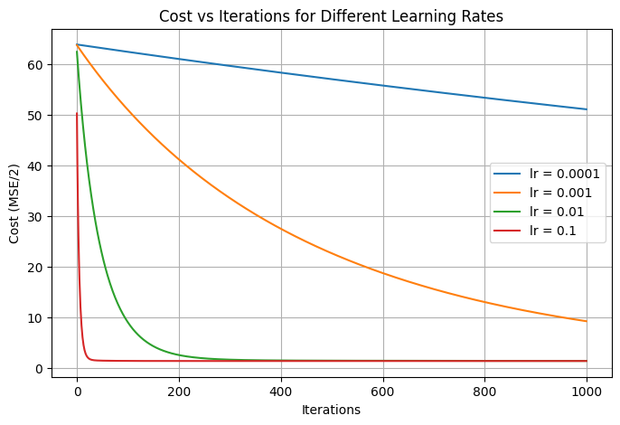
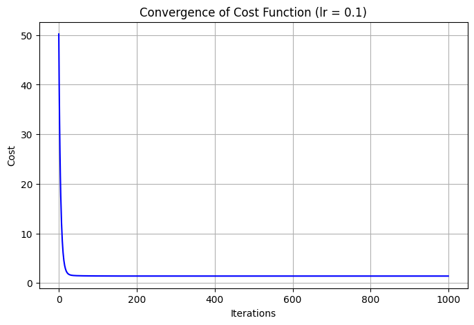
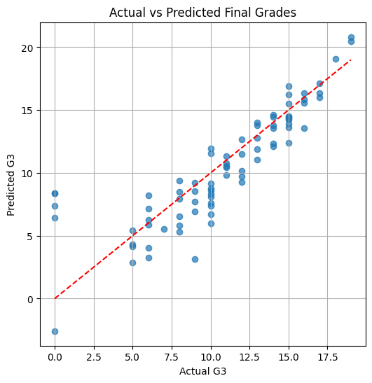
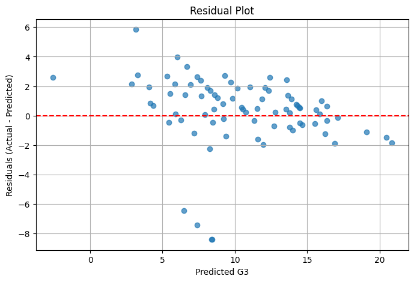
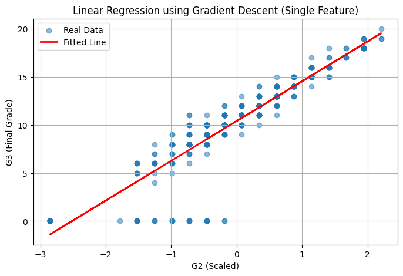
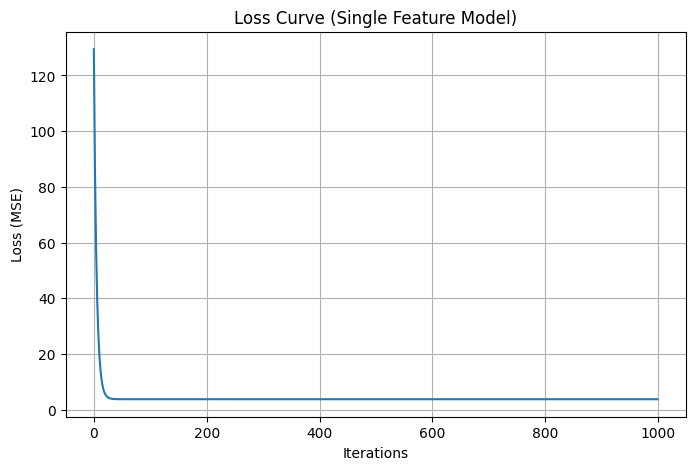
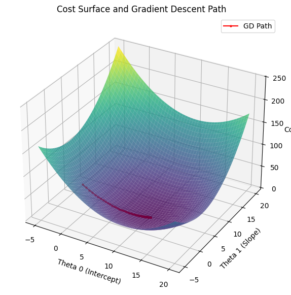
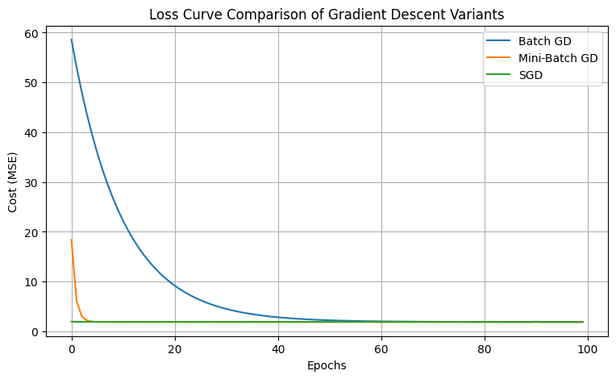
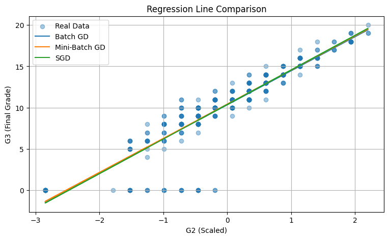

# Lab Experiment 5: Linear Regression through Gradient Descent — Interpretation

**Aim:** To implement Linear Regression using the Gradient Descent optimization algorithm and evaluate its performance on the Student Performance dataset (UCI).

---

## 1. Import Libraries

NumPy is used for matrix operations, Pandas for loading and preprocessing the dataset, Matplotlib for plotting, and scikit-learn only for the train-test split, feature scaling and evaluation metrics. The regression model itself is written from scratch. A random seed of 42 is set so the results are reproducible.

---

## 2. Download and Load the Dataset

The Student Performance dataset is downloaded from the UCI repository and extracted. The `student-mat.csv` file (Mathematics course) is loaded using `sep=';'` since the file is semicolon separated.

**Output:** Shape = (395, 33), i.e. 395 students and 33 attributes.

---

## 3. Data Preprocessing

**Missing values:** Total missing values = 0, so no imputation was required.

**Data types:** 17 categorical (object) columns and 16 numeric columns.

**Encoding:** The 17 categorical columns are converted to numeric using one-hot encoding with `drop_first=True` to avoid the dummy variable trap. After encoding the shape becomes (395, 42).

---

## 4. Feature and Target Selection

`G3` (final grade, 0–20) is chosen as the target variable and all remaining 41 columns are used as input features.

**Output:** Features = (395, 41), Target = (395, 1).

---

## 5. Train-Test Split

The data is split 80:20 giving 316 training samples and 79 testing samples.

---

## 6. Feature Scaling

Standardization is applied so that every feature has mean 0 and standard deviation 1. This is essential for gradient descent, because without scaling the features with larger ranges dominate the gradient and convergence becomes very slow. The scaler is fit only on the training data and then applied to the test data to avoid data leakage. A column of ones is added to both matrices so that the bias (intercept) term is learned along with the weights, making the final training matrix (316, 42).

---

## 7. Linear Regression using Gradient Descent

Two functions are defined:

- `compute_cost` returns the Mean Squared Error cost `J = (1/2m) * Σ(prediction − actual)²`. The 1/2 factor simplifies the derivative.
- `gradient_descent` repeatedly computes the gradient `(1/m) * Xᵀ(Xθ − y)` and updates `θ = θ − α * gradient`, storing the cost after every iteration so convergence can be plotted.

---

## 8. Experimenting with Different Learning Rates

Four learning rates were tested for 1000 iterations each:

| Learning Rate | Final Cost |
| ------------- | ---------- |
| 0.0001        | 51.0313    |
| 0.001         | 9.2543     |
| 0.01          | 1.4302     |
| 0.1           | 1.4115     |

**Interpretation:** With lr = 0.0001 the steps are so small that the cost barely moved from its starting value and the model did not converge. lr = 0.001 improved the cost to 9.25 but was still far from the minimum. lr = 0.01 reached 1.4302 and lr = 0.1 reached 1.4115, both close to the true minimum. This shows that a very small learning rate converges too slowly, while a suitably large one converges much faster. None of the values caused divergence, so no learning rate was too large here.

---

## 9. Loss (Cost) vs Number of Iterations

**Interpretation:** The curve for lr = 0.1 drops almost vertically within the first 100 iterations and then flattens. lr = 0.01 follows a similar shape but takes longer. lr = 0.001 is still visibly decreasing at iteration 1000, and lr = 0.0001 is nearly a flat line at the top, confirming it has hardly learned anything. This plot clearly demonstrates the effect of the learning rate on the speed of convergence.

---

## 10. Training the Final Model

lr = 0.1 was chosen as the best learning rate.

- Initial cost: 50.2090
- Final cost: 1.4115

**Interpretation:** The cost falls steeply during the first 100 iterations and then becomes almost horizontal, which is the expected smooth convergence of batch gradient descent on a convex cost function. There is no oscillation or increase in cost, confirming the learning rate is appropriate and the algorithm has converged.

---

## 11. Model Evaluation

| Metric                         | Value  |
| ------------------------------ | ------ |
| Mean Absolute Error (MAE)      | 1.6467 |
| Mean Squared Error (MSE)       | 5.6567 |
| Root Mean Squared Error (RMSE) | 2.3784 |
| R² Score                       | 0.7241 |

**Interpretation:** An R² of 0.7241 means the model explains about 72% of the variation in the final grade. MAE of 1.65 means the prediction is on average off by about 1.6 marks, and RMSE of 2.38 is higher than the MAE, which indicates a few large errors are pulling the value up. On a 0–20 grade scale this is a reasonably good fit.

**Interpretation:** Most points lie close to the red diagonal line, meaning the predicted grades are close to the actual grades. The clear exceptions are the students whose actual G3 is 0 (students who dropped out or did not appear); the model predicts around 8–10 for them, since their G1 and G2 scores were not zero. These points are responsible for most of the error.

---

## 12. Residual Plot

**Interpretation:** The residuals are scattered randomly around the zero line with no funnel or curved pattern, which means the linear model assumption is acceptable and there is no systematic bias. The only visible outliers are the large positive residuals belonging to the actual-zero students discussed above.

---

## 13. Simple Linear Regression on a Single Feature (G2)

Only `G2` (second period grade) is used here so that the fitted line can actually be drawn in 2D. Gradient descent was run for 1000 iterations with lr = 0.05.

- Slope (m): 4.1403
- Intercept (c): 10.4152
- Final Loss: 3.7940

**Interpretation:** A slope of 4.14 on the standardized feature means that a one standard deviation increase in G2 raises the predicted final grade by about 4.1 marks, and the intercept of 10.42 is the predicted grade for an average student. This confirms G2 is a very strong predictor of G3.

**Interpretation:** The fitted red line passes through the centre of the data cloud and follows the upward trend well. The row of points at y = 0 sits well below the line, again showing that the zero-grade students are the main source of error.

**Interpretation:** The MSE drops sharply and flattens within roughly 50 iterations, showing that a single feature model with a well scaled feature converges very quickly.

---

## 14. 3D Visualization of the Cost Surface and Gradient Descent Path

**Interpretation:** The surface is a smooth convex bowl, which is why linear regression has only one global minimum and no local minima. The red path starts at θ = (0, 0) at the top of the bowl and moves down the steepest direction, taking large steps at first where the slope is steep and progressively smaller steps as it approaches the bottom. It settles at approximately θ₀ = 10.42 and θ₁ = 4.14, which matches the parameters obtained in Section 13 and confirms the implementation is correct.

---

## 15. Comparison of Gradient Descent Variants

| Method        | Final Parameters (θ₀, θ₁) | Final Cost |
| ------------- | ------------------------- | ---------- |
| Batch GD      | 10.3535, 4.1158           | 1.8992     |
| Mini-Batch GD | 10.4189, 4.1249           | 1.8971     |
| Stochastic GD | 10.3812, 4.1770           | 1.8982     |

**Interpretation:** All three variants converge to almost identical parameters and nearly the same final cost, showing that the choice of variant affects how the minimum is reached but not where it is.

**Interpretation:** Batch GD uses the entire dataset for a single update per epoch, so its curve is perfectly smooth but it needs the most epochs. Mini-Batch GD performs many updates per epoch and therefore drops to the minimum in very few epochs while staying reasonably stable. SGD also drops very quickly since it updates after every sample, but its curve is slightly noisy because each update is based on only one data point. Mini-Batch GD offers the best balance of speed and stability.

**Interpretation:** The three fitted lines are practically overlapping and cannot be visually distinguished, which confirms that all three optimizers reached the same solution.

---

## 16. Conclusion

Linear Regression was successfully implemented from scratch using the Gradient Descent algorithm on the Student Performance dataset. The learning rate was found to have a direct effect on convergence — too small a value learns almost nothing within the given iterations, while a larger value converges within about 100 iterations. The final model trained with lr = 0.1 achieved MAE = 1.6467, MSE = 5.6567, RMSE = 2.3784 and an R² Score of 0.7241, meaning it explains about 72% of the variance in the final grade. The cost curve, residual plot and 3D cost surface all confirm proper convergence to the global minimum, and the comparison of Batch, Mini-Batch and Stochastic Gradient Descent showed that all three reach the same optimum but differ in convergence speed and smoothness.
